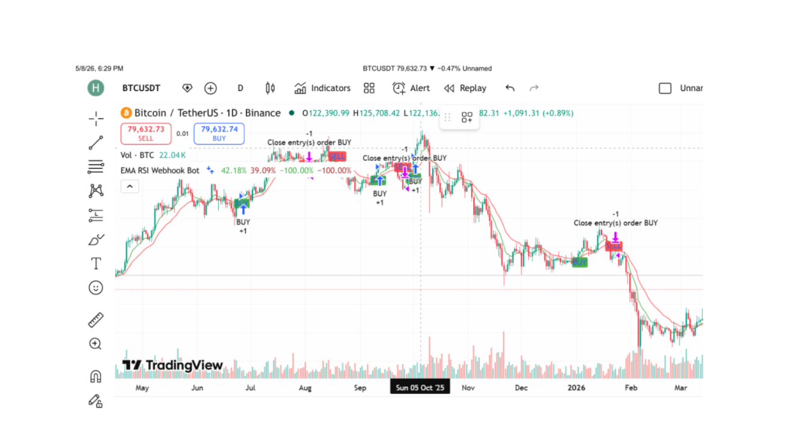
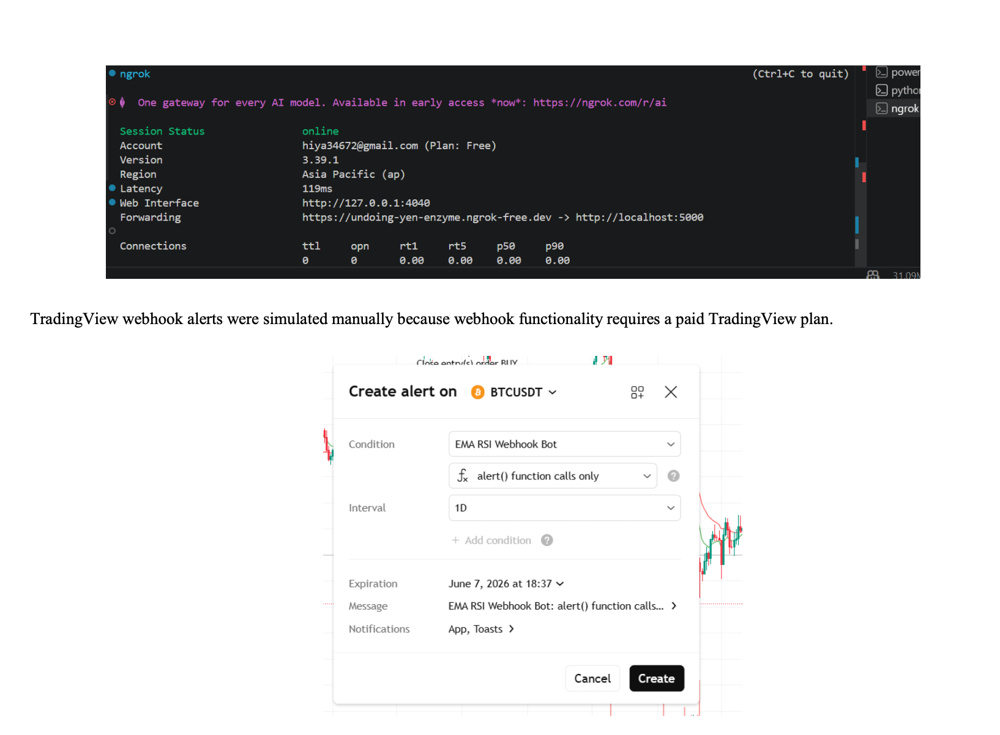
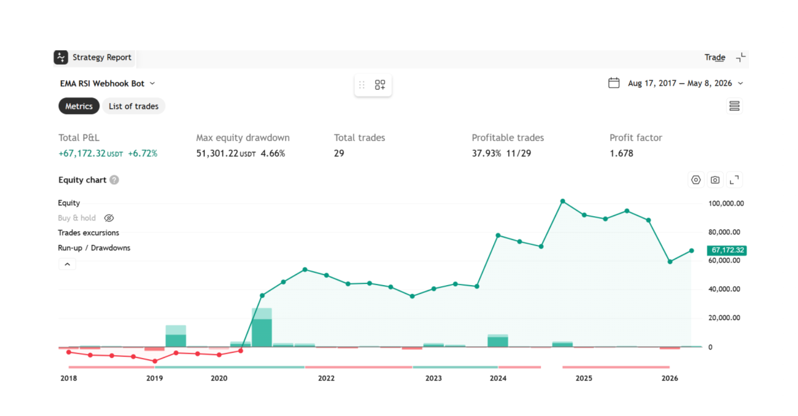

# Automated Trading Bot Using TradingView and Binance Testnet

**Name:** Talal Nadeem
**Roll Number:** 22L-6679
**Assignment:** 4
**Course:** Blockchain and Cryptocurrency

---

## 1. Introduction

This project demonstrates the development of a fully automated trading bot using TradingView, Pine Script, Python Flask, webhooks, and Binance Spot Testnet. The system automatically generates trading signals based on technical indicators and executes demo trades on a cryptocurrency exchange test environment.

The project was developed for educational purposes only using Binance Spot Testnet, ensuring that no real money or live trading was involved.

The complete automation workflow is:

```
TradingView → Webhook → Python Flask Server → Binance Spot Testnet
```

The project includes:

- Pine Script trading strategy
- TradingView chart signals
- Webhook communication
- Python backend server
- Binance Spot Testnet integration
- CSV trade logging

---

## 2. Objectives

The main objectives of this project are:

- Develop a trading strategy using Pine Script
- Generate automated BUY and SELL signals
- Send TradingView alerts as JSON payloads
- Build a Python Flask webhook server
- Execute demo market trades using Binance Testnet API
- Store trade history locally
- Demonstrate automated trading workflow safely using testnet accounts

---

## 3. Technologies Used

| Technology | Purpose |
|---|---|
| TradingView | Charting and signal generation |
| Pine Script v5 | Trading strategy logic |
| Python | Backend development |
| Flask | Webhook server |
| Binance Spot Testnet | Demo trade execution |
| ngrok | Public webhook URL |
| CSV | Trade history storage |
| VS Code | Development environment |

---

## 4. Trading Strategy Overview

The trading strategy is based on:

1. EMA Crossover
2. RSI Confirmation

### 4.1 EMA Crossover

Two Exponential Moving Averages (EMA) are used:

- Fast EMA = 9
- Slow EMA = 21

**Buy Signal**

A BUY signal occurs when:

```
EMA 9 crosses above EMA 21
```

This indicates bullish momentum.

**Sell Signal**

A SELL signal occurs when:

```
EMA 9 crosses below EMA 21
```

This indicates bearish momentum.

### 4.2 RSI Confirmation

The Relative Strength Index (RSI) is used to confirm momentum.

**Buy Confirmation**

```
RSI > 50
```

**Sell Confirmation**

```
RSI < 40
```

The RSI filter helps reduce false signals.

---

## 5. Pine Script Implementation

The Pine Script strategy was developed using Pine Script version 5 in TradingView.

The script performs the following tasks:

- Calculates EMA indicators
- Calculates RSI indicator
- Detects BUY and SELL conditions
- Plots signals on the chart
- Sends webhook alerts in JSON format

### 5.1 Pine Script Code

```pine
//@version=5
strategy("EMA RSI Webhook Bot", overlay=true)

fastEma = ta.ema(close, 9)
slowEma = ta.ema(close, 21)
rsi = ta.rsi(close, 14)

buyCondition = ta.crossover(fastEma, slowEma) and rsi > 50
sellCondition = ta.crossunder(fastEma, slowEma) and rsi < 45

plot(fastEma, color=color.green)
plot(slowEma, color=color.red)

plotshape(buyCondition, style=shape.labelup,
    location=location.belowbar,
    color=color.green,
    text="BUY",
    size=size.small)

plotshape(sellCondition, style=shape.labeldown,
    location=location.abovebar,
    color=color.red,
    text="SELL",
    size=size.small)

if buyCondition
    strategy.entry("BUY", strategy.long)
    alert('{"secret":"my_secret_123","signal":"buy","symbol":"BTCUSDT"}',
        alert.freq_once_per_bar_close)

if sellCondition
    strategy.close("BUY")
    alert('{"secret":"my_secret_123","signal":"sell","symbol":"BTCUSDT"}',
        alert.freq_once_per_bar_close)
```

---

## 6. TradingView Signal Visualization

The Pine Script strategy was applied to the BTCUSDT chart in TradingView.

The chart displayed:

- Green EMA line
- Red EMA line
- BUY labels
- SELL labels



The strategy was also backtested using TradingView Strategy Tester to evaluate performance.



---

## 7. Webhook Integration

Webhook integration was implemented to send TradingView alerts to the Python Flask server.

The alert payload was formatted as JSON:

```json
{
    "secret": "my_secret_123",
    "signal": "buy",
    "symbol": "BTCUSDT"
}
```

The webhook URL was generated using ngrok:

```
https://undoing-yen-enzyme.ngrok-free.dev -> http://localhost:5000
```



TradingView webhook alerts were simulated manually because webhook functionality requires a paid TradingView plan.

---

## 8. Python Flask Backend

The Python backend was developed using Flask.

The server performs the following functions:

- Receives POST webhook requests
- Parses JSON data
- Validates webhook secret
- Executes demo trades on Binance Testnet
- Stores trade history in CSV format
- Handles invalid signals and API errors

### 8.1 Flask Webhook Route

The Flask route listens on:

```
/webhook/tradingview
```

The route accepts TradingView JSON alerts.

### 8.2 Error Handling

The Python bot includes simple error handling for:

- Unauthorized secret key
- Invalid signal values
- Binance API exceptions

Server startup output:

```
* Serving Flask app 'bot'
* Debug mode: on
WARNING: This is a development server. Do not use it in a production deployment.
* Running on http://127.0.0.1:5000
* Restarting with stat
* Debugger is active!
```

Incoming alert log:

```
Incoming alert: {'secret': '***', 'signal': 'buy', 'symbol': 'BTCUSDT'}
127.0.0.1 - - [09/May/2026 16:51:59] "POST /webhook/tradingview HTTP/1.1" 200 -

Incoming alert: {'secret': '***', 'signal': 'sell', 'symbol': 'BTCUSDT'}
127.0.0.1 - - [09/May/2026 16:55:49] "POST /webhook/tradingview HTTP/1.1" 200 -
```

---

## 9. Binance Spot Testnet Integration

Binance Spot Testnet was used to safely simulate cryptocurrency trading.

The Python bot connected to Binance Testnet using:

- API Key
- Secret Key

The following operations were tested:

- Demo market BUY orders
- Demo market SELL orders

No real funds were used during testing.

### 9.1 Testnet API Connection

The Python bot connected using:

```python
client_API_URL = "https://testnet.binance.vision"
```

This ensured all trades were executed only in the Binance demo environment.

Demo trade executed response:

| message | order |
|---|---|
| Demo trade executed | orderId: 1176655, cumulativeQuoteQty: 0, executedQty: 0.001 |

---

## 10. Trade History Storage

Trade history was stored locally in:

```
data/trades.csv
```

The CSV file recorded:

- Time
- Signal type
- Trading pair
- Quantity
- Trade status
- API response

Example:

| time | signal | symbol | quantity | status |
|---|---|---|---|---|
| 2026-05-09 | buy | BTCUSDT | 0.001 | success |
| 2026-05-09 | sell | BTCUSDT | 0.001 | success |

---

## 11. Workflow Diagram

The complete workflow of the system is shown below:

```
                TradingView Chart
                      │
               Pine Script Strategy
                      │
                Buy/Sell Signal
                      │
               Webhook JSON Alert
                      │
              Python Flask Server
                      │
          Binance Spot Testnet API
                      │
             Demo Trade Execution
                      │
              CSV Trade History
```

---

## 12. Manual Webhook Testing

Since TradingView webhook alerts require a paid subscription, webhook functionality was manually tested using curl commands.

Example BUY request:

```bash
curl -X POST http://127.0.0.1:5000/webhook/tradingview \
  -H "Content-Type: application/json" \
  -d '{"secret":"my_secret_123","signal":"buy","symbol":"BTCUSDT"}'
```

Example SELL request:

```bash
curl -X POST http://127.0.0.1:5000/webhook/tradingview \
  -H "Content-Type: application/json" \
  -d '{"secret":"my_secret_123","signal":"sell","symbol":"BTCUSDT"}'
```

The Flask terminal successfully received the alerts and executed the demo trade workflow.

---

## 13. Results

The project successfully achieved:

- Trading signal generation using Pine Script
- EMA and RSI strategy implementation
- TradingView signal visualization
- Webhook communication
- Flask server implementation
- Binance Spot Testnet integration
- Demo BUY and SELL trade execution
- CSV trade logging

The complete automation chain worked successfully in the test environment.

---

## 14. Challenges Faced

Some challenges encountered during development included:

- TradingView webhook limitations on free plan
- ngrok authentication setup
- PowerShell curl command compatibility
- Python package configuration
- Binance Testnet API setup

These issues were resolved through manual webhook testing and proper environment configuration.

---

## 15. Future Improvements

Future improvements could include:

- Stop-loss and take-profit automation
- Advanced risk management
- Streamlit or Flask dashboard interface
- Real-time performance analytics
- Multi-coin support
- Database integration
- Email or Telegram notifications
- Live exchange deployment (with proper security)

---

## 16. Conclusion

This project successfully demonstrated the implementation of an automated cryptocurrency trading bot using TradingView, Pine Script, Python Flask, webhooks, and Binance Spot Testnet.

The system generated automated BUY and SELL signals using EMA crossover and RSI confirmation. Webhook communication successfully transferred alerts to the Flask server, which executed demo market trades on Binance Testnet and stored trade history locally.

The project achieved the primary objective of building a fully automated demo trading workflow without using real funds. The implementation also demonstrated practical knowledge of algorithmic trading, API integration, Python backend development, and webhook automation.

---

*End of Report*
